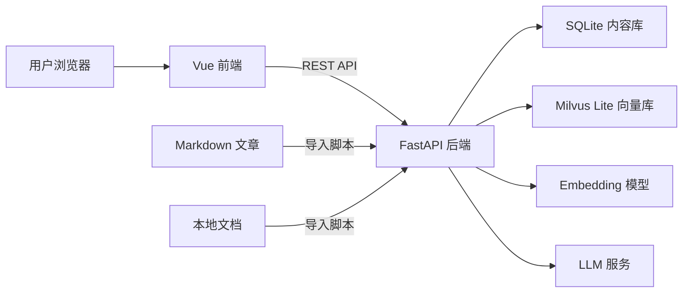

# 个人博客设计方案

## 1. 项目概述

本项目是一个极简、可扩展的个人技术博客，核心目标是展示个人基本介绍与文章，并通过 RAG 知识库问答系统展示个人技术能力。知识库不仅包含博客文章，还包含用户另外放置在本地目录中的文档。系统不包含后台管理界面与登录系统，所有内容都通过本地文件和导入脚本管理。

## 2. 设计原则

- 极简：只保留核心功能，避免权限、评论、复杂统计等非必要模块。
- 可扩展：模块边界清晰，后续可平滑接入全文搜索、订阅、评论、后台管理等能力。
- 低运维：优先使用嵌入式数据库，降低部署和维护成本。
- 内容与代码分离：文章和本地文档都以文件形式管理，便于版本控制和迁移。

## 3. 功能需求

### 3.1 前台博客

- 首页：个人简介、最新文章、标签入口。
- 文章列表：支持分页和标签筛选。
- 文章详情：渲染 Markdown 内容，展示发布时间、标签等信息。
- 关于我：展示基本介绍、技术栈、联系方式。

### 3.2 RAG 知识库问答

- 用户输入自然语言问题。
- 系统从知识库中检索最相关的文章或本地文档片段。
- 知识来源包括博客文章，以及用户放置在本地的文档。
- 结合检索上下文生成回答，并展示引用来源。
- 支持多轮对话上下文，历史消息由前端维护，并通过 OpenAI 兼容的 messages 格式提交。

### 3.3 内容管理

- 不提供后台管理界面。
- 文章以 Markdown 文件存储在仓库中，本地文档放置在专门的知识目录中。
- 提供导入脚本：识别文件类型并提取文本，将元信息写入 SQLite，并将正文切分、向量化后写入 Milvus Lite。
- 导入时机：后端服务启动时自动执行导入脚本，解析并更新文章与文档。
- 降级策略：向量库或 Embedding 服务不可用时，仍同步 SQLite 元数据，仅跳过向量化，博客浏览功能不受影响。
- 当前支持的文章/文档格式：Markdown，后续再扩展 PDF、Word 等。

## 4. 非功能需求

- 性能：文章详情加载尽量控制在 300ms 内；问答接口在低并发场景下保持流畅响应。
- 可扩展性：检索、向量库、LLM 通过抽象接口隔离，便于替换。
- 可维护性：清晰的目录结构、统一的错误处理和日志。
- 安全性：不暴露敏感配置；对用户输入做基础校验。

## 5. 技术选型

| 类别       | 技术                                                         | 说明                                                         |
| :--------- | :----------------------------------------------------------- | :----------------------------------------------------------- |
| 后端框架   | FastAPI                                                      | 异步、自动生成接口文档、类型友好                             |
| 前端框架   | Vue 3 + Vite                                                 | 组件化、生态成熟                                             |
| 前端路由   | Vue Router                                                   | SPA 路由                                                     |
| 关系数据库 | SQLite                                                       | 存储文章、标签等结构化数据                                   |
| 向量数据库 | Milvus Lite                                                  | 本地嵌入式向量检索，适合个人项目                             |
| ORM        | SQLModel                                                     | 与 FastAPI、Pydantic 集成良好                                |
| 向量模型   | 硅基流动（SiliconFlow）平台免费模型 BAAI/bge-m3、BAAI/bge-reranker-v2-m3 | bge-m3 负责召回（输出 1024 维向量），bge-reranker-v2-m3 负责重排序；均通过 HTTP API 调用，无需本地部署 |
| LLM        | OpenAI 兼容接口（当前配置为 DeepSeek）                       | 用于问答改写与生成回答，base_url / 模型通过 config.ini 配置  |
| 部署       | Uvicorn + 静态前端                                           | 单进程部署，简化运维                                         |

## 6. 系统架构



## 7. 核心流程

### 7.1 知识导入流程

1. 扫描文章目录和本地文档目录，识别文件类型。
2. 对 Markdown 文章解析 front matter，对 Markdown 文档提取正文文本。
3. 将文章或文档的元信息写入 SQLite（posts 或 documents 表）。
4. 将正文按句号和换行符分句，基于相邻句子向量相似度进行语义分块；仅在当前块达到最低字符数且相邻句子相似度骤降时切分，并以最大字符数兜底。
5. 对每个 chunk 生成向量，存入 Milvus Lite，并记录来源类型、来源 ID 和位置映射。

### 7.2 问答流程

1. 前端提交 OpenAI 兼容的 messages 数组，包含当前问题及历史消息。
2. 后端根据问题改写 Query（调用 LLM，拆分子问题或润色或补全指代），改写后的 Query 用于检索。
3. 在 Milvus Lite 中检索 top-k 个相关片段，top-k 从 config.ini 读取。
4. 对候选片段进行重排序和去重。
5. 将原始问题与检索片段组装为 prompt，调用 LLM 生成回答。
6. 返回回答及引用来源，包括来源类型、来源 ID、标题和片段；前端根据 source_type + source_id 拼装链接。

## 8. 数据设计

### 8.1 SQLite 表结构

**posts 文章表**

| 字段       | 类型        | 说明                                                       |
| :--------- | :---------- | :--------------------------------------------------------- |
| id         | INTEGER PK  | 文章 ID                                                    |
| slug       | TEXT UNIQUE | URL 唯一标识                                               |
| title      | TEXT        | 标题                                                       |
| summary    | TEXT        | 摘要                                                       |
| content_md | TEXT        | Markdown 原文                                              |
| status     | TEXT        | published / draft                                          |
| file_path  | TEXT        | 源 Markdown 文件相对文章目录的路径，用于增量同步与删除检测 |
| created_at | DATETIME    | 创建时间                                                   |
| updated_at | DATETIME    | 更新时间                                                   |

**tags 标签表**

| 字段 | 类型        | 说明     |
| :--- | :---------- | :------- |
| id   | INTEGER PK  | 标签 ID  |
| name | TEXT UNIQUE | 标签名   |
| slug | TEXT UNIQUE | 标签标识 |

**post_tags 文章标签关联表**

| 字段    | 类型       | 说明    |
| :------ | :--------- | :------ |
| post_id | INTEGER FK | 文章 ID |
| tag_id  | INTEGER FK | 标签 ID |

**documents 本地文档表**

| 字段       | 类型       | 说明                         |
| :--------- | :--------- | :--------------------------- |
| id         | INTEGER PK | 文档 ID                      |
| file_name  | TEXT       | 原始文件名                   |
| title      | TEXT       | 显示标题，可取自文件名或内容 |
| file_path  | TEXT       | 本地文件相对路径             |
| file_type  | TEXT       | md，后续可扩展其他类型       |
| file_hash  | TEXT       | 文件哈希，用于识别变更       |
| status     | TEXT       | active / removed             |
| created_at | DATETIME   | 创建时间                     |
| updated_at | DATETIME   | 更新时间                     |

**chunks 片段表**

| 字段        | 类型       | 说明                                       |
| :---------- | :--------- | :----------------------------------------- |
| id          | INTEGER PK | 片段 ID                                    |
| source_type | TEXT       | 来源类型：post / document                  |
| source_id   | INTEGER    | 来源记录 ID，指向 posts.id 或 documents.id |
| chunk_index | INTEGER    | 片段顺序                                   |
| content     | TEXT       | 片段文本                                   |
| milvus_id   | TEXT       | Milvus 中的向量 ID                         |

### 8.2 向量数据

Milvus Lite 中每个 chunk 对应一条向量记录，包含：

- 向量字段：embedding，1024 维（BAAI/bge-m3 输出维度，Milvus 集合需按此维度建立）
- 元数据：source_type、source_id、chunk_id、title

## 9. API 设计

| 方法 | 路径                    | 说明                                       |
| :--- | :---------------------- | :----------------------------------------- |
| GET  | /api/health             | 健康检查                                   |
| GET  | /api/posts              | 文章列表，支持分页和标签筛选               |
| GET  | /api/posts/{slug}       | 文章详情                                   |
| GET  | /api/posts/id/{post_id} | 按 ID 查文章，供问答引用来源跳转到对应文章 |
| GET  | /api/tags               | 标签列表                                   |
| GET  | /api/about              | 个人简介信息                               |
| POST | /api/chat               | RAG 问答接口                               |

### 9.1 问答接口示例

请求：

```json
{
  "messages": [
    {
      "role": "user",
      "content": "你擅长哪些技术？"
    }
  ]
}
```

响应：

```json
{
  "answer": "我主要使用 FastAPI、Vue 等技术……",
  "sources": [
    {
      "title": "关于我",
      "source_type": "post",
      "source_id": 1,
      "chunk": "……",
      "score": 0.92
    }
  ]
}
```

## 10. 前端页面结构

| 路由         | 页面       | 说明                                    |
| :----------- | :--------- | :-------------------------------------- |
| /            | 首页       | 简介、最新文章、标签入口、问答引导      |
| /articles    | 文章列表   | 分页、标签筛选（支持 ?tag= 深链）       |
| /posts/:slug | 文章详情   | 渲染 Markdown，仅有返回按钮、无顶部导航 |
| /about       | 关于我     | 个人介绍                                |
| /chat        | 知识库问答 | RAG 对话界面                            |

布局约定：除文章详情页外，所有页面顶部均有导航栏（主页 / 文章 / 问答 / 关于，品牌 Logo 也可回首页）；问答页隐藏页脚。

## 11. 目录结构

```text
Blog/
├── docs/
│   └── design.md
├── backend/
│   ├── app/
│   │   ├── main.py
│   │   ├── api/
│   │   ├── core/
│   │   ├── models/
│   │   ├── schemas/
│   │   └── services/
│   ├── scripts/
│   ├── data/                 # 运行期数据：blog.db、milvus.db（不入库）
│   ├── config.ini            # 实际配置（含密钥，不入库）
│   ├── config.example.ini
│   ├── requirements.txt
│   └── README.md
├── frontend/
│   ├── src/
│   │   ├── views/
│   │   ├── components/
│   │   ├── router/
│   │   ├── api/
│   │   ├── assets/
│   │   └── directives/
│   ├── package.json
│   └── README.md
├── content/
│   ├── posts/
│   │   └── *.md
│   ├── documents/
│   │   └── *.md
│   └── about.md
└── README.md
```

## 12. 部署方案

- 前端执行 `npm run build` 生成静态文件。
- 后端通过 FastAPI 挂载静态文件，或由 Nginx 托管静态资源并反向代理 API。
- 使用 Uvicorn 单进程运行，适合个人低流量场景。
- SQLite 和 Milvus Lite 均以本地文件或嵌入式方式运行，无需额外服务。
- 可选：使用 Docker 镜像打包，便于迁移和复现。
