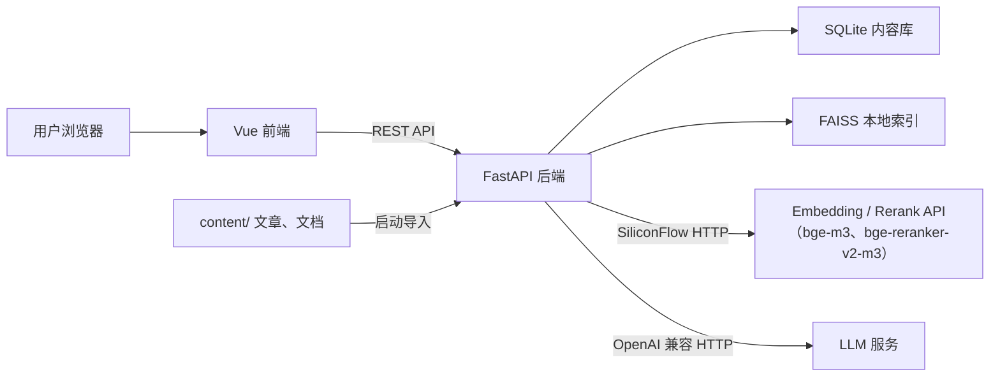

# 个人博客 + 智能问答系统设计方案（已停止更新）

## 1. 项目概述

本项目是一个极简、可扩展的个人技术博客，核心目标是展示个人基本介绍与文章，并通过 RAG 问答系统展示个人技术能力。问答系统的知识来源为博客文章与预先放置在本地目录中的文档；重复问题复用由 RAG 历史生成、缓存在 SQLite 中的问答记录，以省去重复的 LLM 生成并加速响应。系统不包含后台管理界面与登录系统，所有内容都通过本地文件管理。

## 2. 设计原则

- 极简：只保留核心功能，避免权限、评论、复杂统计等非必要模块。
- 可扩展：模块边界清晰，后续可平滑接入全文搜索、订阅、评论、后台管理等能力。
- 低运维：优先使用嵌入式数据库，降低部署和维护成本。
- 内容与代码分离：文章和本地文档都以文件形式管理，便于版本控制和迁移。

## 3. 功能需求

### 3.1 前台博客

- 首页：个人简介、最新文章、标签入口。
- 文章列表：支持分页和标签筛选。
- 文章详情：渲染 Markdown 内容，展示发布时间、标签等信息。
- 关于我：展示基本介绍、技术栈、联系方式，内容实时读取 `content/about.md`。

### 3.2 缓存问答（RAG 语义缓存）

- 不单独维护预设问答文件；缓存问答作为 RAG 问答的语义缓存，缓存条目为「问题 + 答案 + 引用来源」。
- 用户新问题在进入 RAG 前先做缓存匹配：命中（相似度达到设定阈值）则直接返回缓存答案与来源，不消耗 LLM，响应更快。
- 未命中时走 RAG 生成；生成后将「问题 / 答案 / 来源」写入缓存，供后续相似问题复用。
- 缓存条目带有效期（`expires_at`），到期即清理，避免旧答案被长期复用。

### 3.3 RAG 问答

- 用户输入自然语言问题。
- 系统从知识库中检索最相关的文章或本地文档片段。
- 知识来源包括博客文章，以及用户放置在本地的文档。
- 结合检索上下文生成回答，并展示引用来源。
- 支持多轮对话上下文，历史消息由前端维护，并通过 OpenAI 兼容的 messages 格式提交。
- 对于历史问过的问题，优先复用缓存的生成结果（见 §3.2），减少 LLM 消耗并加速响应。

### 3.4 内容管理

- 不提供后台管理界面。
- 文章以 Markdown 文件存储在仓库中，本地文档放置在专门的知识目录中。
- 提供导入脚本：识别文件类型并提取文本，将元信息写入 SQLite，并将正文切分、向量化后写入 FAISS。
- 导入时机：后端服务启动时自动执行导入脚本，解析并更新文章与文档。
- 启动降级策略：向量库或 Embedding 服务不可用时不阻止启动——博客的文章、标签、关于我接口仍可用，仅问答检索降级不可用；导入流程继续同步 SQLite 元数据（含 `file_hash`），仅跳过切分与向量化，待服务恢复后重启即可自动补偿缺失的向量。
- 当前支持的文章/文档格式：Markdown，后续再扩展 PDF、Word 等。

## 4. 非功能需求

- 性能：文章详情加载尽量控制在 300ms 内；问答接口在低并发场景下保持流畅响应。
- 可扩展性：检索、向量库、Embedding、LLM 通过抽象接口隔离，便于替换。
- 可维护性：清晰的目录结构、统一的错误处理和日志。
- 安全性：不暴露敏感配置；对用户输入做基础校验。

## 5. 技术选型

| 类别       | 技术                                                         | 说明                                                         |
| :--------- | :----------------------------------------------------------- | :----------------------------------------------------------- |
| 后端框架   | FastAPI                                                      | 异步、自动生成接口文档、类型友好                             |
| 前端框架   | Vue 3 + Vite                                                 | 组件化、生态成熟                                             |
| 前端路由   | Vue Router                                                   | SPA 路由                                                     |
| 关系数据库 | SQLite                                                       | 存储文章、标签及问答缓存等结构化数据                         |
| 向量索引   | FAISS                                                        | 本地精确向量检索，适合个人项目                               |
| ORM        | SQLModel                                                     | 与 FastAPI、Pydantic 集成良好                                |
| 向量模型   | 硅基流动（SiliconFlow）API：BAAI/bge-m3、BAAI/bge-reranker-v2-m3 | 通过 SiliconFlow 的 `/v1/embeddings` 与 `/v1/rerank` 接口调用；bge-m3 负责召回（输出 1024 维稠密向量），bge-reranker-v2-m3 负责重排序。无需本地部署模型或加载权重，api_key / base_url / 模型名通过 config.ini 配置 |
| LLM        | OpenAI 兼容接口（当前配置为 DeepSeek）                       | 用于问答改写与生成回答，base_url / 模型通过 config.ini 配置  |
| 部署       | Uvicorn + 静态前端                                           | 单进程部署，简化运维                                         |

## 6. 系统架构



## 7. 核心流程


### 7.1 知识自动导入与增量同步流程

系统在启动时自动调用知识导入与同步脚本（`KnowledgeSync`），扫描 `content/` 目录下的 Markdown 文件，实现免手动介入的增量更新与失效清理。具体步骤如下：

#### 1. 系统启动与文件扫描

- 服务启动时，递归扫描 `content/` 目录下的所有 `.md` 文件；`content/` 根目录下的 `about.md` 除外——该文件不入知识库、不参与检索，仅用于「关于我」页面渲染。
- 计算每个文件的 SHA-256 哈希值，建立当前磁盘文件的映射表：`Disk_Files = { rel_path: file_hash }`。

#### 2. 变更判定策略（新增 / 更新 / 删除）

将磁盘文件映射与 SQLite 数据库中记录的 `file_path` 及 `file_hash` 进行比对：

- **未变更文件**（`file_path` 存在且 `file_hash` 未变）：跳过处理，不消耗 Embedding 算力。
- **失效删除**（SQLite 中存在，但磁盘 `content/` 下已被删除）：
  1. 从 SQLite 查询该来源的 Chunk ID，并在 FAISS 中批量删除对应向量。
  2. 在 SQLite 中同步删除该条目（`posts` 或 `documents` 表）。
- **新增 / 全量更新文件**（新增路径，或已有路径的 `file_hash` 发生变化）：
  1. **覆盖重置**：若为更新操作，优先清理 FAISS 中该来源旧有的向量 Chunk，并在 SQLite 中重置元信息。
  2. **解析内容**：
     - 若为博客文章（如带 yaml 头），解析 Front Matter 提取 `title`、`tags`、`created_at` 等元信息，正文作为主内容；
     - 若为通用 Markdown 文档，提取首个一级标题为 `title`，全篇正文作为主内容。
  3. **数据落库**：将最新元信息与 `file_hash` 写入 SQLite，获取/更新该记录的唯一主键 ID（`source_id`）。

#### 3. 动态语义分块（Semantic Chunking）

针对需要导入/更新的文件正文：

- **按句拆分**：将正文按句号、问号、感叹号及换行符（`\n\n`）切分为原子句子列表。
- **语义滑动窗口计算**：基于 BGE-M3 模型计算相邻句子的向量余弦相似度。
- **边界切分判定**：
  - 设置 `min_chunk_size`（如 200 字）与 `max_chunk_size`（如 800 字）。
  - 当当前 Block 累计字符数达到 `min_chunk_size` 且相邻句子相似度出现骤降（如跌破设定阈值 0.65）时，触发切分。
  - 若 Block 达到 `max_chunk_size` 仍未骤降，强制触发兜底切分，确保 Chunk 大小均匀。

#### 4. 向量生成与 FAISS 索引落库

- **向量化**：调用 SiliconFlow `/v1/embeddings`（模型 BAAI/bge-m3）为切分出的每个 Chunk 生成 1024 维稠密向量。
- **向量写入**：批量写入 FAISS 索引；索引只保存向量和 Chunk ID，来源元数据继续保存在 SQLite：
  - `id`: Chunk 唯一主键
  - `dense_vector`: 稠密向量
  - `source_type`、`source_id`、`chunk_index`：仅作为 SQLite `chunks` 表字段，用于检索结果回填

#### 5. 重启/刷新内存问答缓存

知识库同步完成后，重新加载 SQLite 中 `status = active` 的问答缓存条目（仅问题与问题向量），构建内存匹配索引，供 §7.2 阶段一使用；已过期或标记为 `invalidated` 的条目在加载时剔除。

### 7.2 问答流程

#### 阶段一：问答缓存命中

1. **启动清理与装载缓存**：系统启动时先清空 SQLite 中已有的问答缓存，再加载空的内存匹配索引；运行期新增缓存后同步追加该索引。`answer` 与 `sources` 不常驻内存。
2. **提问向量化**：收到前端提交的 `messages` 数组后，提取用户最新问题，调用 BGE-M3 生成其 1024 维稠密向量。
3. **相似度比对**：将问题向量与内存字典中的所有缓存问题向量做余弦相似度打分。SiliconFlow 仅输出稠密向量、不提供稀疏向量，因此缓存匹配不使用关键词检索。
4. **过期清理**：每次读取缓存后，清理 `expires_at` 已到期的条目（从内存索引移除，并在 SQLite 标记 `invalidated` 或删除），避免继续命中过期内容。
5. **阈值判定与命中返回**：
   - **若最高相似度 ≥ 设定阈值**（缓存命中阈值在 `config.ini` 的 `[qa_cache]` 节配置，如 `similarity_threshold`）：按缓存 id 从 SQLite 读出该条目的 `answer` 与 `sources`，构造与 `/api/chat` 完全一致的响应返回前端，流程立即结束，零 LLM 消耗。
   - **若最高相似度 ＜ 设定阈值**：判定为未缓存的新问题，进入 **阶段二 RAG 流程**。

> 说明：缓存以「用户当前问题」为匹配键，因此适合自包含、可独立成句的问题；依赖上下文的追问（如“那它的性能如何”）难以命中缓存，会正常走阶段二。

#### 阶段二：RAG 深度问答

1. **Query 改写**：后端将历史消息与当前问题提交给 LLM，进行指代消除与上下文补全（例如将“它的优点是什么”改写为“FastAPI 框架的优点是什么”），输出检索专用的 `search_query`。
2. **向量召回**：使用 `search_query` 生成的稠密向量，在 FAISS 索引中按 Inner Product 检索，取回 `top-k` 个最相关的文章/文档片段（`top-k` 从 `config.ini` 读取）。
3. **重排序与去重**：调用 `BAAI/bge-reranker-v2-m3` 对候选片段进行二次交叉注意力打分，截取 `top-n`（如 Top 5）最贴切的片段并按 `source_id` + `chunk_index` 剔除冗余；分数低于 `[retrieval]` 的 `min_score` 的片段会被过滤，剩余片段再按 `chunks.id` 升序恢复文档顺序。
4. **上下文组装与生成**：仅将通过最低置信度且已按文档块主键排序的片段组装进 Prompt 模板，调用 LLM 生成回答。
5. **结构化返回**：返回最终回答及通过最低置信度的引用来源列表，包含 `source_type`（`post` / `document`）、`source_id`、`title` 和片段内容；所有引用来源均仅展示片段、不提供跳转。
6. **写入问答缓存**：无论回答来源分数、来源数量或回答是否为兜底文案，都将「用户原始问题、生成的答案、引用来源」以及该问题的稠密向量写入 SQLite 缓存表（`expires_at = now + cache_ttl`），并把「问题 + 问题向量」追加进内存匹配索引；缓存生效后，后续相似问题可由阶段一命中。

## 8. 数据设计

### 8.1 SQLite 表结构

**posts 文章表**

| 字段       | 类型        | 说明                                                       |
| :--------- | :---------- | :--------------------------------------------------------- |
| id         | INTEGER PK  | 文章 ID                                                    |
| slug       | TEXT UNIQUE | URL 唯一标识                                               |
| title      | TEXT        | 标题                                                       |
| summary    | TEXT        | 摘要                                                       |
| content_md | TEXT        | Markdown 原文                                              |
| status     | TEXT        | published / draft                                          |
| file_path  | TEXT        | 源 Markdown 文件相对文章目录的路径，用于增量同步与删除检测 |
| file_hash  | TEXT        | 源文件内容的 SHA-256 哈希，用于增量同步的变更判定         |
| created_at | DATETIME    | 创建时间                                                   |
| updated_at | DATETIME    | 更新时间                                                   |

**tags 标签表**

| 字段 | 类型        | 说明     |
| :--- | :---------- | :------- |
| id   | INTEGER PK  | 标签 ID  |
| name | TEXT UNIQUE | 标签名   |
| slug | TEXT UNIQUE | 标签标识 |

**post_tags 文章标签关联表**

| 字段    | 类型       | 说明    |
| :------ | :--------- | :------ |
| post_id | INTEGER FK | 文章 ID |
| tag_id  | INTEGER FK | 标签 ID |

**documents 本地文档表**

| 字段       | 类型       | 说明                         |
| :--------- | :--------- | :--------------------------- |
| id         | INTEGER PK | 文档 ID                      |
| file_name  | TEXT       | 原始文件名                   |
| title      | TEXT       | 显示标题，可取自文件名或内容 |
| file_path  | TEXT       | 本地文件相对路径             |
| file_hash  | TEXT       | 文件哈希，用于识别变更       |
| created_at | DATETIME   | 创建时间                     |
| updated_at | DATETIME   | 更新时间                     |

**chunks 片段表**

| 字段        | 类型       | 说明                                       |
| :---------- | :--------- | :----------------------------------------- |
| id          | INTEGER PK | 片段 ID                                    |
| source_type | TEXT       | 来源类型：post / document                  |
| source_id   | INTEGER    | 来源记录 ID，指向 posts.id 或 documents.id |
| chunk_index | INTEGER    | 片段顺序                                   |
| content     | TEXT       | 片段文本                                   |

**qa_cache 缓存问答表**

| 字段         | 类型       | 说明                                                   |
| :----------- | :--------- | :----------------------------------------------------- |
| id           | INTEGER PK | 缓存条目 ID                                            |
| question     | TEXT       | 用户原始问题（展示用，也是缓存匹配的文本来源）         |
| answer       | TEXT       | 缓存答案（Markdown 正文）                              |
| sources      | TEXT       | 引用来源，JSON 数组，结构与 `/api/chat` 响应 `sources` 一致 |
| question_vector | TEXT    | 问题向量的 JSON 数组（1024 维），启动时载入内存用于相似度匹配 |
| status       | TEXT       | active / invalidated，仅 active 条目进入匹配           |
| expires_at   | DATETIME   | 缓存过期时间，写入时设为 `now + cache_ttl`（`[qa_cache]` 节配置），到期即清理 |
| created_at   | DATETIME   | 创建时间                                               |
| updated_at   | DATETIME   | 更新时间                                               |

字段约定：

- `question` / `answer` / `sources` 与 `/api/chat` 响应字段对齐，前端可复用现有渲染逻辑。
- `question_vector` 随缓存条目一并保存，启动时将「问题 + 问题向量」装入内存用于匹配；命中后再按 id 读取 `answer` / `sources`。
- `expires_at`：写入缓存时设为「当前时间 + 缓存有效期（TTL）」，有效期可通过 `[qa_cache]` 节的 `cache_ttl` 配置；到期条目在每次读取缓存后清理（标记 `invalidated` 或删除）。
- 命中缓存时返回的 `sources` 非空（即当时 RAG 生成的引用来源）。

### 8.2 向量数据

FAISS 索引中每个 chunk 对应一条向量记录，字段与 §7.1 第 4 步保持一致：

- `id`：Chunk 唯一主键（INT64），与 SQLite `chunks` 表主键同值
- `dense_vector`：稠密向量（1024 维），使用 FAISS `IndexIDMap2(IndexFlatIP)` 保存
- `source_type`、`source_id`、`chunk_index`：保存在 SQLite，不写入 FAISS

说明：问答缓存的「问题向量」不写入 FAISS，随缓存条目存储在 SQLite。启动及写入新条目时，仅将「问题 + 问题向量」装入内存用于相似度比对，命中后再按 id 从 SQLite 读取 `answer` 与 `sources`（`answer` / `sources` 不常驻内存）。

片段原文不写入 FAISS，统一存储在 SQLite `chunks.content`；FAISS 仅保存向量和用于定位的 `id`，来源元数据由 SQLite 提供。

### 8.3 内容文件结构（Markdown）

所有内容文件均为 UTF-8 编码的 Markdown；文章以 Front Matter 承载元信息，文档与 `about.md` 各有约定。

**文章（`content/posts/*.md`）**

```markdown
---
title: 关于这个博客
slug: about-this-blog
summary: 这是博客的第一篇文章，介绍这个站点的由来。
tags: [随笔]
status: published
created_at: 2026-08-19 10:00:00
---

文章正文（Markdown）……
```

字段约定：

- `title`（必填）：文章标题，缺失时回退为文件名。
- `slug`（可选）：URL 唯一标识，缺失时由文件名生成，全站不可重复。
- `summary`（可选）：文章摘要，展示于列表页。
- `tags`（可选）：标签数组，支持中文标签。
- `status`（可选，默认 `published`）：published / draft。
- `created_at`（可选）：发布时间，格式 `YYYY-MM-DD HH:MM:SS`，缺失时回退为导入时间。

**本地文档（`content/documents/*.md`）**

不带 Front Matter：提取首个一级标题为 `title`（无一级标题时回退为文件名），全篇正文作为主内容。

**关于我（`content/about.md`）**

不入知识库（见 §7.1），仅作为「关于我」页面数据源。Front Matter 承载结构化个人信息，正文为详细介绍：

```markdown
---
name: SuLy
summary: 后端开发者，关注 Python 大模型、检索增强生成与个人知识管理。
tech_stack:
  - Python / FastAPI
  - Vue 3 / Vite
  - SQLite / SQLModel
  - FAISS
  - BGE-M3 / BGE-Reranker
contact:
  email: hi@swayrift.top
  github: https://github.com/swayrift
---

详细介绍正文（Markdown）……
```

`/api/about` 实时读取该文件，将 Front Matter 结构化字段与正文一并返回前端渲染。

## 9. API 设计

| 方法 | 路径                    | 说明                                       |
| :--- | :---------------------- | :----------------------------------------- |
| GET  | /api/posts              | 文章列表，支持分页和标签筛选               |
| GET  | /api/posts/{slug}       | 文章详情                                   |
| GET  | /api/posts/id/{post_id} | 按数据库 ID 查文章，供问答引用来源跳转（需声明在 `/{slug}` 之前） |
| GET  | /api/tags               | 标签列表                                   |
| GET  | /api/about              | 个人简介信息，实时读取 `content/about.md` 内容返回 |
| POST | /api/chat               | RAG 问答接口                               |

### 9.1 问答接口示例

请求：

```json
{
  "messages": [
    {
      "role": "user",
      "content": "你擅长哪些技术？"
    }
  ]
}
```

响应：

```json
{
  "answer": "我主要使用 FastAPI、Vue 等技术……",
  "sources": [
    {
      "title": "我的 FastAPI 实践笔记",
      "source_type": "post",
      "source_id": 1,
      "chunk": "……",
      "score": 0.92
    }
  ]
}
```

问答缓存命中时直接返回缓存内容，结构与正常响应一致（含当时的引用来源）：

```json
{
  "answer": "我主要使用 FastAPI、Vue 3 等技术……",
  "sources": [
    {
      "title": "我的 FastAPI 实践笔记",
      "source_type": "post",
      "source_id": 1,
      "chunk": "……",
      "score": 0.92
    }
  ]
}
```

## 10. 前端页面结构

| 路由         | 页面     | 说明                               |
| :----------- | :------- | :--------------------------------- |
| /            | 首页     | 简介、最新文章、标签入口、问答引导 |
| /articles    | 文章列表 | 分页、标签筛选（支持 ?tag= 深链）  |
| /posts/:slug | 文章详情 | 渲染 Markdown，底部提供返回按钮    |
| /about       | 关于我   | 个人介绍                           |
| /chat        | 问答系统 | RAG 对话界面（问答缓存自动复用）   |

布局约定：除文章详情页外，所有页面顶部均有导航栏（主页 / 文章 / 问答 / 关于，品牌 Logo 也可回首页）；问答页隐藏页脚。

风格要求：黑色 + 橙色为主要色调，简约、卡片、灵动。

## 11. 目录结构

```text
Blog/
├── docs/
│   └── design.md
├── backend/
│   ├── app/
│   │   ├── main.py
│   │   ├── api/
│   │   ├── core/
│   │   ├── models/
│   │   ├── schemas/
│   │   └── services/
│   ├── scripts/
│   ├── data/                 # 运行期数据：blog.db、faiss/（不入库）
│   ├── config.ini            # 实际配置（含密钥，不入库）
│   ├── config.example.ini
│   ├── requirements.txt
│   └── README.md
├── frontend/
│   ├── src/
│   │   ├── views/
│   │   ├── components/
│   │   ├── router/
│   │   ├── api/
│   │   ├── assets/
│   │   └── directives/
│   ├── package.json
│   └── README.md
├── content/
│   ├── posts/
│   │   └── *.md
│   ├── documents/
│   │   └── *.md
│   └── about.md
└── README.md
```

## 12. 部署方案

- 前端执行 `npm run build` 生成静态文件，构建产物由 Nginx 接管。
- 使用 Uvicorn 单进程运行，适合个人低流量场景。
- SQLite 和 FAISS 均以本地文件或嵌入式方式运行，无需额外服务。
- Embedding 与重排模型通过 SiliconFlow 的 HTTP API 调用（`/v1/embeddings`、`/v1/rerank`），无需本地部署模型或加载权重，后端不承担模型内存开销。
- 可选：使用 Docker 镜像打包，便于迁移和复现。
